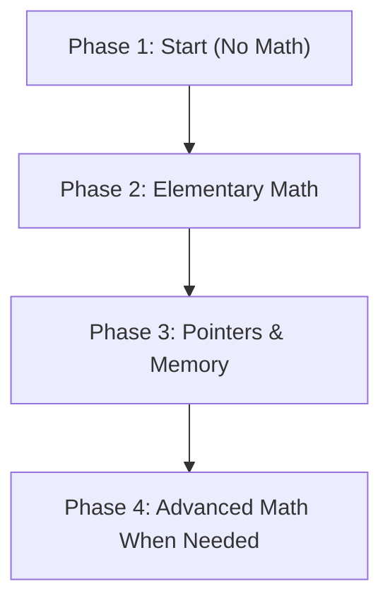

# Math Requirements for C Programming — Topic-wise Breakdown

> Learn C with minimal math. This guide shows what math each topic needs, quick exercises, and a suggested learning path.

---

**Contents:**

- [At-a-Glance Topics Table](#at-a-glance-topics-table)
- [Learning Phases (visual)](#learning-phases-visual)
- [Interactive Exercises](#interactive-exercises)
- [Quick Math Refresher](#quick-math-refresher)
- [Study Checklist](#study-checklist)

---

## At-a-Glance Topics Table

| Topic                   |           Math Level | Why / Notes                           |
| ----------------------- | -------------------: | ------------------------------------- |
| Introduction & Setup    |                 None | Installing and running programs       |
| Basic Program Structure |                 None | Syntax, headers, main                 |
| Data Types              |                 None | Learn type names and uses             |
| Variables & Constants   |                 None | Naming and initialization             |
| Operators               |           Elementary | +, -, \*, /, % — used daily           |
| Control Flow (if/loops) |           Elementary | Comparisons, simple counting          |
| Arrays & Strings        |           Elementary | Indexing starts at 0                  |
| Functions               |           Elementary | Passing values, return types          |
| Pointers                |                  Low | Concept: addresses; basic arithmetic  |
| Dynamic Memory          |                  Low | Multiplication for size calculations  |
| Structures & Unions     |             None/Low | Grouping data; layout awareness helps |
| File I/O                |                 None | Reading/writing bytes/text            |
| Math Library (pow, sin) | Advanced (as-needed) | Only for specific domains             |

---

## Learning Phases (visual)

Below is a simple flowchart of recommended phases. (GitHub supports Mermaid diagrams in many places.)

---

## Interactive Exercises

Try these quick exercises. Click "Show Answer" to reveal hints/solutions.

### Exercise 1 — Remainder

What is the remainder of `29 % 6`?

Show Answer

29 / 6 = 4 remainder 5, so `29 % 6 == 5`.

### Exercise 2 — Array Indexing

If `int a[5];` what is the index of the last element?

Show Answer

Indexes are `0..4`, so the last index is `4`.

### Exercise 3 — Memory Size

How many bytes for `malloc(12 * sizeof(int))` if `sizeof(int) == 4`?

Show Answer

12 \* 4 = 48 bytes.

---

## Quick Math Refresher

- Division & remainder: `17 / 5 == 3`, `17 % 5 == 2`.
- Array indexing: first element is index `0`.
- Memory formula: `bytes_needed = count * sizeof(type)`.

You can use KaTeX inline for equations: $N \\times s$ means N times size s.

---

## Study Checklist

- [ ] Install a compiler (e.g., `gcc` or `clang`)
- [ ] Write and run "Hello, World!"
- [ ] Practice `for` loops and `if` statements
- [ ] Manipulate arrays and strings
- [ ] Read/write small files
- [ ] Try `malloc`/`free` for dynamic arrays

---

## Tips & Next Steps

- Start immediately with Phase 1 topics — no math barrier.
- When a topic needs a math concept, learn that math in a focused way (example-driven).
- Use the interactive exercises above to self-check; add more problems and answers as you go.

---

