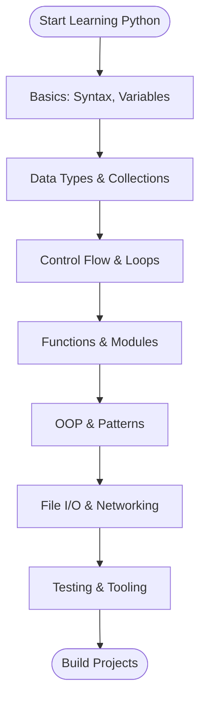

<!-- Header: styled intro, badges, TOC, flowchart, and quick examples -->


# Complete Python Language Map (2025)

> The Atlas Protocol — a complete, beginner-to-advanced Python roadmap. This file maps concepts to short, copy-pasteable examples so you can learn by doing.

---

**Contents:**

- Quick Flowchart
- Quick Examples (copy/paste)
- Full Concept Map (detailed reference)

---

## Quick Flowchart



---

## Quick Examples (copy/paste)

### Hello World

```python
print("Hello, world!")
```

### Variables & Types

```python
x = 42           # int
pi = 3.14        # float
name = "Broccoli"  # str
is_ready = True  # bool
```

### f-strings & Formatting

```python
user = 'Ada'
print(f'Welcome, {user}!')
```

### List & Comprehension

```python
nums = [1,2,3,4]
squares = [n*n for n in nums]
```

### Dictionary & Iteration

```python
person = {'name':'Ada','age':30}
for k,v in person.items():
   print(k, v)
```

### Conditional & Loop

```python
for i in range(5):
   if i % 2 == 0:
      print(i, 'even')
   else:
      print(i, 'odd')
```

### Function with args/kwargs

```python
def greet(name, /, greeting='Hi', **meta):
   print(f"{greeting}, {name}!", meta)

greet('Ada', greeting='Hello', role='student')
```

### Lambda & map/filter

```python
nums = [1,2,3,4]
ed = list(map(lambda x: x%2==0, nums))
evens = list(filter(lambda x: x%2==0, nums))
```

### Generator Example

```python
def counter(n):
   i = 0
   while i < n:
      yield i
      i += 1

for v in counter(3):
   print(v)
```

### Class / OOP

```python
class Person:
   def __init__(self, name):
      self.name = name
   def greet(self):
      return f'Hello, {self.name}'

print(Person('Ada').greet())
```

### File I/O

```python
with open('notes.txt','w',encoding='utf-8') as f:
   f.write('Hello file')
```

### Exception Handling

```python
try:
   1/0
except ZeroDivisionError:
   print('cannot divide by zero')
```

### Using a Standard Library Module

```python
import json
print(json.dumps({'a':1}))
```

### Simple Unit Test (unittest)

```python
import unittest

def add(a,b):
   return a+b

class TestMath(unittest.TestCase):
   def test_add(self):
      self.assertEqual(add(2,3), 5)

if __name__ == '__main__':
   unittest.main()
```

---

## Full Concept Map (detailed reference)

...existing code...

# Complete Python Language Map (2025)

## 1. Basic Building Blocks

a) **Variables & Assignment** - a1) Variable naming rules - a2) Multiple assignment - a3) Unpacking assignment - a4) Walrus operator (:=)

b) **Comments** - b1) Single-line comments (#) - b2) Multi-line comments (""" or ''' ) - b3) Docstrings

c) **Indentation & Code Structure** - c1) Whitespace significance - c2) Line continuation (\) - c3) Statement separators (;)
a) **Variables & Assignment** - a1) Variable naming rules - a2) Multiple assignment - a3) Unpacking assignment - a4) Walrus operator (:=)

b) **Comments** - b1) Single-line comments (#) - b2) Multi-line comments (""" or ''') - b3) Docstrings

c) **Indentation & Code Structure** - c1) Whitespace significance - c2) Line continuation (\) - c3) Statement separators (;)

## 2. Data Types (Built-in)

a) **Numeric Types** - a1) int (integers) - a2) float (floating-point) - a3) complex (complex numbers) - a4) bool (Boolean - True/False)

b) **Sequence Types** - b1) str (strings) - b2) list (mutable sequences) - b3) tuple (immutable sequences) - b4) range (number sequences) - b5) bytes (immutable byte sequences) - b6) bytearray (mutable byte sequences)

c) **Mapping Types** - c1) dict (dictionaries/hash maps)

d) **Set Types** - d1) set (mutable sets) - d2) frozenset (immutable sets)

e) **None Type** - e1) None (null value)

f) **Binary Sequence Types** - f1) memoryview (memory buffer interface)

## 3. Operators

a) **Arithmetic Operators** - a1) + (addition) - a2) - (subtraction) - a3) \* (multiplication) - a4) / (division) - a5) // (floor division) - a6) % (modulus) - a7) \*\* (exponentiation)

b) **Comparison Operators** - b1) == (equal) - b2) != (not equal) - b3) > (greater than) - b4) < (less than) - b5) >= (greater than or equal) - b6) <= (less than or equal)

c) **Logical Operators** - c1) and - c2) or - c3) not

d) **Bitwise Operators** - d1) & (AND) - d2) | (OR) - d3) ^ (XOR) - d4) ~ (NOT) - d5) << (left shift) - d6) >> (right shift)

e) **Assignment Operators** - e1) = (basic assignment) - e2) += (add and assign) - e3) -= (subtract and assign) - e4) \*= (multiply and assign) - e5) /= (divide and assign) - e6) //= (floor divide and assign) - e7) %= (modulus and assign) - e8) \*\*= (exponent and assign) - e9) &= (bitwise AND and assign) - e10) |= (bitwise OR and assign) - e11) ^= (bitwise XOR and assign) - e12) >>= (right shift and assign) - e13) <<= (left shift and assign)

f) **Membership Operators** - f1) in - f2) not in

g) **Identity Operators** - g1) is - g2) is not

## 4. Keywords (Reserved Words)

a) **Control Flow Keywords** - a1) if - a2) elif - a3) else - a4) match (Python 3.10+) - a5) case (Python 3.10+)

b) **Loop Keywords** - b1) for - b2) while - b3) break - b4) continue - b5) pass

c) **Function/Class Keywords** - c1) def - c2) return - c3) yield - c4) class - c5) lambda

d) **Exception Handling Keywords** - d1) try - d2) except - d3) finally - d4) raise - d5) assert

e) **Import Keywords** - e1) import - e2) from - e3) as

f) **Scope Keywords** - f1) global - f2) nonlocal

g) **Boolean Keywords** - g1) True - g2) False - g3) None - g4) and - g5) or - g6) not

h) **Context Manager Keywords** - h1) with

i) **Async Keywords** - i1) async - i2) await

j) **Other Keywords** - j1) del - j2) in - j3) is

## 5. String Operations

a) **String Creation** - a1) Single quotes ('') - a2) Double quotes ("") - a3) Triple quotes (''' or """) - a4) Raw strings (r'') - a5) f-strings (f'') - a6) Byte strings (b'')

b) **String Methods** - b1) upper(), lower(), capitalize() - b2) strip(), lstrip(), rstrip() - b3) split(), rsplit(), splitlines() - b4) join() - b5) replace() - b6) find(), rfind(), index(), rindex() - b7) count() - b8) startswith(), endswith() - b9) isalpha(), isdigit(), isalnum(), isspace() - b10) format(), format_map() - b11) encode(), decode() - b12) center(), ljust(), rjust() - b13) zfill() - b14) expandtabs() - b15) partition(), rpartition() - b16) translate(), maketrans() - b17) casefold() - b18) swapcase(), title() - b19) isprintable(), isidentifier() - b20) isdecimal(), isnumeric()

c) **String Formatting** - c1) % formatting (old style) - c2) str.format() - c3) f-strings (formatted string literals) - c4) Template strings

d) **String Indexing & Slicing** - d1) Positive indexing - d2) Negative indexing - d3) Slicing [start:stop:step]

e) **Escape Sequences** - e1) \n (newline) - e2) \t (tab) - e3) \\ (backslash) - e4) \' (single quote) - e5) \" (double quote) - e6) \r (carriage return) - e7) \b (backspace) - e8) \f (form feed) - e9) \ooo (octal) - e10) \xhh (hexadecimal) - e11) \uxxxx (Unicode 16-bit) - e12) \Uxxxxxxxx (Unicode 32-bit)

## 6. Lists

a) **List Creation** - a1) Literal syntax [] - a2) list() constructor - a3) List comprehensions

b) **List Methods** - b1) append() - b2) extend() - b3) insert() - b4) remove() - b5) pop() - b6) clear() - b7) index() - b8) count() - b9) sort() - b10) reverse() - b11) copy()

c) **List Operations** - c1) Concatenation (+) - c2) Repetition (\*) - c3) Membership testing (in) - c4) Slicing - c5) Indexing - c6) Length (len()) - c7) Min/Max (min(), max()) - c8) Sum (sum())

d) **List Comprehensions** - d1) Basic comprehensions - d2) Conditional comprehensions - d3) Nested comprehensions

## 7. Tuples

a) **Tuple Creation** - a1) Literal syntax () - a2) tuple() constructor - a3) Single element tuples (x,) - a4) Named tuples

b) **Tuple Methods** - b1) count() - b2) index()

c) **Tuple Operations** - c1) Concatenation - c2) Repetition - c3) Membership - c4) Slicing - c5) Indexing - c6) Unpacking - c7) Packing

## 8. Dictionaries

a) **Dictionary Creation** - a1) Literal syntax {} - a2) dict() constructor - a3) Dictionary comprehensions - a4) fromkeys()

b) **Dictionary Methods** - b1) get() - b2) setdefault() - b3) pop() - b4) popitem() - b5) clear() - b6) keys() - b7) values() - b8) items() - b9) update() - b10) copy()

c) **Dictionary Operations** - c1) Indexing by key - c2) Membership testing (in) - c3) Length (len()) - c4) Merging (| operator, Python 3.9+) - c5) Update (|= operator, Python 3.9+)

## 9. Sets

a) **Set Creation** - a1) Literal syntax {} - a2) set() constructor - a3) Set comprehensions - a4) frozenset()

b) **Set Methods** - b1) add() - b2) update() - b3) remove() - b4) discard() - b5) pop() - b6) clear() - b7) union() - b8) intersection() - b9) difference() - b10) symmetric_difference() - b11) issubset() - b12) issuperset() - b13) isdisjoint() - b14) copy()

c) **Set Operations** - c1) Union (|) - c2) Intersection (&) - c3) Difference (-) - c4) Symmetric difference (^) - c5) Membership testing (in) - c6) Length (len())

## 10. Control Flow Structures

a) **Conditional Statements** - a1) if statement - a2) if-else statement - a3) if-elif-else statement - a4) Ternary operator (x if condition else y) - a5) match-case statement (Python 3.10+)

b) **Pattern Matching (Python 3.10+)** - b1) Literal patterns - b2) Capture patterns - b3) Wildcard pattern (\_) - b4) Sequence patterns - b5) Mapping patterns - b6) Class patterns - b7) OR patterns (|) - b8) Guard clauses (if)

## 11. Loops

a) **for Loop** - a1) Iterating over sequences - a2) range() function - a3) enumerate() - a4) zip() - a5) Nested for loops - a6) for-else clause

b) **while Loop** - b1) Basic while loop - b2) while-else clause - b3) Infinite loops

c) **Loop Control** - c1) break statement - c2) continue statement - c3) pass statement

d) **Iteration Tools** - d1) iter() - d2) next() - d3) reversed() - d4) sorted() - d5) filter() - d6) map() - d7) reduce() (from functools)

## 12. Functions

a) **Function Definition** - a1) def keyword - a2) Function naming - a3) Parameters - a4) Return statement - a5) Docstrings

b) **Parameters & Arguments** - b1) Positional parameters - b2) Default parameters - b3) Keyword arguments - b4) _args (variable positional) - b5) \*\*kwargs (variable keyword) - b6) Positional-only parameters (/) - b7) Keyword-only parameters (_)

c) **Function Types** - c1) Regular functions - c2) Lambda functions - c3) Generator functions (yield) - c4) Async functions (async def) - c5) Recursive functions

d) **Function Features** - d1) First-class functions - d2) Higher-order functions - d3) Closures - d4) Nested functions - d5) Function annotations - d6) Type hints

e) **Scope** - e1) Local scope - e2) Enclosing scope - e3) Global scope - e4) Built-in scope - e5) global keyword - e6) nonlocal keyword

## 13. Object-Oriented Programming (OOP)

a) **Class Basics** - a1) class keyword - a2) **init**() constructor - a3) self parameter - a4) Instance variables - a5) Class variables - a6) Instance methods - a7) Class methods (@classmethod) - a8) Static methods (@staticmethod)

b) **OOP Principles** - b1) Encapsulation - b2) Inheritance - b3) Polymorphism - b4) Abstraction

c) **Inheritance** - c1) Single inheritance - c2) Multiple inheritance - c3) super() function - c4) Method Resolution Order (MRO) - c5) Multilevel inheritance - c6) Hierarchical inheritance

d) **Special Methods (Dunder Methods)** - d1) **init**() (constructor) - d2) **str**() (string representation) - d3) **repr**() (official representation) - d4) **len**() (length) - d5) **getitem**() (indexing) - d6) **setitem**() (item assignment) - d7) **delitem**() (item deletion) - d8) **iter**() (iteration) - d9) **next**() (next item) - d10) **contains**() (membership) - d11) **call**() (callable objects) - d12) **enter**(), **exit**() (context managers) - d13) **add**(), **sub**(), etc. (operator overloading) - d14) **eq**(), **ne**(), **lt**(), etc. (comparison) - d15) **hash**() (hashing) - d16) **del**() (destructor) - d17) **new**() (object creation) - d18) **getattr**(), **setattr**(), **delattr**() - d19) **dict** (attribute dictionary) - d20) **class** (class reference) - d21) **name** (name attribute) - d22) **module** (module attribute) - d23) **bases** (base classes) - d24) **doc** (docstring) - d25) **annotations** (type annotations)

e) **Properties** - e1) @property decorator - e2) Getter methods - e3) Setter methods (@x.setter) - e4) Deleter methods (@x.deleter) - e5) property() function

f) **Access Modifiers** - f1) Public attributes - f2) Protected attributes (\_variable) - f3) Private attributes (\_\_variable) - f4) Name mangling

g) **Abstract Classes** - g1) abc module - g2) ABC base class - g3) @abstractmethod decorator

h) **Data Classes (Python 3.7+)** - h1) @dataclass decorator - h2) field() function - h3) Automatic **init**() - h4) Automatic **repr**() - h5) Automatic **eq**()

i) **Metaclasses** - i1) type() function - i2) **metaclass** attribute - i3) Custom metaclasses

## 14. Modules & Packages

a) **Modules** - a1) Creating modules (.py files) - a2) import statement - a3) from...import statement - a4) import...as statement - a5) **name** == "**main**" - a6) Module search path - a7) sys.path - a8) Reloading modules (importlib.reload())

b) **Packages** - b1) Package structure - b2) **init**.py - b3) Subpackages - b4) Relative imports (.) - b5) Absolute imports - b6) Namespace packages (PEP 420)

c) **Built-in Modules (Standard Library Highlights)** - c1) os (operating system interface) - c2) sys (system-specific parameters) - c3) math (mathematical functions) - c4) random (random number generation) - c5) datetime (date and time) - c6) time (time access and conversions) - c7) re (regular expressions) - c8) json (JSON encoder/decoder) - c9) csv (CSV file reading/writing) - c10) collections (specialized container datatypes) - c11) itertools (iterator functions) - c12) functools (higher-order functions) - c13) pathlib (object-oriented filesystem paths) - c14) pickle (object serialization) - c15) copy (shallow and deep copy) - c16) argparse (command-line parsing) - c17) logging (logging facility) - c18) unittest (unit testing framework) - c19) sqlite3 (SQLite database) - c20) threading (thread-based parallelism) - c21) multiprocessing (process-based parallelism) - c22) asyncio (asynchronous I/O) - c23) subprocess (subprocess management) - c24) socket (low-level networking) - c25) urllib (URL handling) - c26) email (email handling) - c27) xml (XML processing) - c28) zipfile (ZIP archive handling) - c29) gzip (gzip compression) - c30) hashlib (secure hashes and message digests) - c31) secrets (cryptographically strong random numbers) - c32) typing (type hints support) - c33) dataclasses (data classes) - c34) enum (enumerations) - c35) decimal (decimal fixed-point arithmetic) - c36) fractions (rational numbers) - c37) statistics (mathematical statistics) - c38) io (core tools for working with streams) - c39) shutil (high-level file operations) - c40) glob (Unix style pathname patterns)

## 15. File Handling

a) **File Operations** - a1) open() function - a2) File modes (r, w, a, x, b, t, +) - a3) read() method - a4) readline() method - a5) readlines() method - a6) write() method - a7) writelines() method - a8) close() method - a9) with statement (context manager) - a10) seek() method - a11) tell() method - a12) flush() method

b) **File Types** - b1) Text files - b2) Binary files - b3) CSV files - b4) JSON files - b5) XML files - b6) Pickle files

c) **Path Operations** - c1) os.path module - c2) pathlib module - c3) File existence checking - c4) Directory operations - c5) Path joining - c6) Path splitting - c7) File extension handling

## 16. Exception Handling

a) **Try-Except Blocks** - a1) try clause - a2) except clause - a3) Multiple except clauses - a4) Generic except - a5) else clause - a6) finally clause

b) **Raising Exceptions** - b1) raise statement - b2) raise from (exception chaining) - b3) Custom exceptions

c) **Built-in Exceptions** - c1) Exception (base class) - c2) AttributeError - c3) IOError - c4) ImportError - c5) IndexError - c6) KeyError - c7) KeyboardInterrupt - c8) NameError - c9) OSError - c10) RuntimeError - c11) StopIteration - c12) SyntaxError - c13) TypeError - c14) ValueError - c15) ZeroDivisionError - c16) FileNotFoundError - c17) PermissionError - c18) TimeoutError - c19) MemoryError - c20) RecursionError - c21) AssertionError - c22) NotImplementedError

d) **Exception Context** - d1) Exception arguments - d2) Exception attributes - d3) Traceback objects - d4) sys.exc_info()

## 17. Iterators & Generators

a) **Iterators** - a1) Iterator protocol - a2) **iter**() method - a3) **next**() method - a4) iter() function - a5) next() function - a6) StopIteration exception

b) **Generators** - b1) Generator functions (yield) - b2) Generator expressions - b3) yield from statement - b4) send() method - b5) close() method - b6) throw() method

c) **Itertools Module** - c1) count() - c2) cycle() - c3) repeat() - c4) chain() - c5) compress() - c6) dropwhile() - c7) takewhile() - c8) filterfalse() - c9) groupby() - c10) islice() - c11) starmap() - c12) tee() - c13) zip_longest() - c14) product() - c15) permutations() - c16) combinations() - c17) combinations_with_replacement()

## 18. Decorators

a) **Function Decorators** - a1) @ syntax - a2) Wrapper functions - a3) functools.wraps() - a4) Multiple decorators - a5) Decorators with arguments

b) **Class Decorators** - b1) Decorating classes - b2) @classmethod - b3) @staticmethod - b4) @property - b5) @dataclass

c) **Built-in Decorators** - c1) @property - c2) @classmethod - c3) @staticmethod - c4) @abstractmethod - c5) @functools.lru_cache - c6) @functools.wraps - c7) @functools.total_ordering

## 19. Context Managers

a) **with Statement** - a1) Context manager protocol - a2) **enter**() method - a3) **exit**() method - a4) Multiple context managers

b) **contextlib Module** - b1) @contextmanager decorator - b2) closing() - b3) suppress() - b4) redirect_stdout() - b5) redirect_stderr() - b6) ExitStack

## 20. Regular Expressions

a) **re Module** - a1) Pattern syntax - a2) match() function - a3) search() function - a4) findall() function - a5) finditer() function - a6) sub() function - a7) split() function - a8) compile() function

b) **Pattern Elements** - b1) Literal characters - b2) . (any character) - b3) ^ (start of string) - b4) $ (end of string) - b5) \* (0 or more) - b6) + (1 or more) - b7) ? (0 or 1) - b8) {m,n} (m to n repetitions) - b9) [] (character class) - b10) | (alternation) - b11) () (grouping) - b12) \d, \w, \s (character classes) - b13) \D, \W, \S (negated classes) - b14) \b (word boundary) - b15) Lookahead/lookbehind assertions

c) **Flags** - c1) re.IGNORECASE (re.I) - c2) re.MULTILINE (re.M) - c3) re.DOTALL (re.S) - c4) re.VERBOSE (re.X) - c5) re.ASCII (re.A)

## 21. Collections Module

a) **Specialized Containers** - a1) namedtuple() - a2) deque (double-ended queue) - a3) Counter - a4) OrderedDict - a5) defaultdict - a6) ChainMap

b) **Methods & Features** - b1) deque append/appendleft - b2) deque pop/popleft - b3) Counter most_common() - b4) Counter elements() - b5) defaultdict default_factory

## 22. Functional Programming

a) **Built-in Functions** - a1) map() - a2) filter() - a3) zip() - a4) enumerate() - a5) any() - a6) all() - a7) sorted() - a8) reversed()

b) **functools Module** - b1) reduce() - b2) partial() - b3) lru_cache() - b4) wraps() - b5) total_ordering() - b6) singledispatch()

c) **operator Module** - c1) itemgetter() - c2) attrgetter() - c3) methodcaller() - c4) Function equivalents for operators

## 23. Type Hints & Annotations

a) **Basic Type Hints** - a1) int, str, float, bool - a2) List, Dict, Set, Tuple (from typing) - a3) Optional - a4) Union - a5) Any

b) **Advanced Type Hints** - b1) Callable - b2) TypeVar - b3) Generic - b4) Protocol - b5) Literal - b6) Final - b7) ClassVar - b8) TypedDict

c) **Type Checking** - c1) mypy tool - c2) type() function - c3) isinstance() - c4) issubclass()

## 24. Comprehensions

a) **List Comprehensions** - a1) Basic syntax - a2) With conditions - a3) Nested comprehensions

b) **Dictionary Comprehensions** - b1) Key-value generation - b2) Conditional dict comprehensions

c) **Set Comprehensions** - c1) Unique value generation

d) **Generator Expressions** - d1) Lazy evaluation - d2) Memory efficiency

## 25. Memory Management

a) **Reference Counting** - a1) sys.getrefcount() - a2) Reference semantics

b) **Garbage Collection** - b1) gc module - b2) gc.collect() - b3) gc.get_objects() - b4) Circular references

c) **Object Identity** - c1) id() function - c2) is operator - c3) Object interning

## 26. Copying Objects

a) **copy Module** - a1) Shallow copy (copy.copy()) - a2) Deep copy (copy.deepcopy()) - a3) Mutable vs immutable objects

b) **Assignment vs Copying** - b1) Reference assignment - b2) Copy constructors - b3) Slice copying

## 27. Date & Time

a) **datetime Module** - a1) date class - a2) time class - a3) datetime class - a4) timedelta class - a5) tzinfo class - a6) timezone class

b) **time Module** - b1) time() - b2) sleep() - b3) strftime() - b4) strptime() - b5) gmtime() - b6) localtime()

c) **calendar Module** - c1) Calendar operations - c2) Month/year calculations

## 28. Mathematical Operations (continued)

a) math Module

- a1) Trigonometric functions (sin, cos, tan)
- a2) Logarithmic functions (log, log10)
- a3) Power and roots (sqrt, pow)
- a4) Constants (pi, e, tau, inf, nan)
- a5) Rounding (ceil, floor, trunc)
- a6) Factorial, gcd
- a7) Hyperbolic functions
  b) random Module
- b1) random()
- b2) randint()
- b3) choice()
- b4) choices()
- b5) sample()
- b6) shuffle()
- b7) uniform()
- b8) gauss()
- b9) seed()
  c) statistics Module
- c1) mean()
- c2) median()
- c3) mode()
- c4) stdev()
- c5) variance()
  d) **decimal Module** - d1) Decimal class - d2) Precision control - d3) Rounding modes - d4) Context settings
  e) **fractions Module** - e1) Fraction class - e2) Rational number arithmetic - e3) limit_denominator()

## 29. Asynchronous Programming

a) **asyncio Module** - a1) Event loop - a2) Coroutines - a3) Tasks - a4) Futures - a5) asyncio.run() - a6) asyncio.create_task() - a7) asyncio.gather() - a8) asyncio.wait() - a9) asyncio.sleep()

b) **async/await Syntax** - b1) async def (coroutine definition) - b2) await expression - b3) async with (async context managers) - b4) async for (async iteration)

c) **Async Generators** - c1) async def with yield - c2) Async comprehensions

d) **Async Context Managers** - d1) **aenter**() - d2) **aexit**()

e) **Async Iterators** - e1) **aiter**() - e2) **anext**()

## 30. Concurrency & Parallelism

a) **threading Module** - a1) Thread class - a2) start() method - a3) join() method - a4) Lock - a5) RLock (reentrant lock) - a6) Semaphore - a7) Event - a8) Condition - a9) Barrier - a10) Timer - a11) Thread-local data - a12) active_count() - a13) current_thread()

b) **multiprocessing Module** - b1) Process class - b2) Pool class - b3) Queue - b4) Pipe - b5) Manager - b6) Lock, Semaphore (process-level) - b7) Value, Array (shared memory) - b8) cpu_count()

c) **concurrent.futures Module** - c1) ThreadPoolExecutor - c2) ProcessPoolExecutor - c3) submit() - c4) map() - c5) as_completed() - c6) wait() - c7) Future objects

d) **queue Module** - d1) Queue (FIFO) - d2) LifoQueue (LIFO/Stack) - d3) PriorityQueue - d4) put() - d5) get() - d6) task_done() - d7) join()

e) **Global Interpreter Lock (GIL)** - e1) Understanding GIL - e2) Impact on threading - e3) CPU-bound vs I/O-bound

## 31. Networking

a) **socket Module** - a1) Socket types (TCP, UDP) - a2) socket() function - a3) bind() - a4) listen() - a5) accept() - a6) connect() - a7) send()/sendall() - a8) recv() - a9) close() - a10) Socket options

b) **urllib Module** - b1) urllib.request (URL opening) - b2) urllib.parse (URL parsing) - b3) urllib.error (exceptions) - b4) urlopen() - b5) Request objects - b6) quote()/unquote()

c) **http Module** - c1) http.client (HTTP protocol) - c2) http.server (HTTP servers) - c3) http.cookies (cookie handling) - c4) HTTPConnection - c5) HTTPSConnection

## 32. JSON Handling

a) **json Module** - a1) dumps() (serialize to string) - a2) dump() (serialize to file) - a3) loads() (deserialize from string) - a4) load() (deserialize from file) - a5) JSONEncoder - a6) JSONDecoder - a7) indent parameter - a8) sort_keys parameter - a9) Custom encoders/decoders

## 33. XML Processing

a) **xml.etree.ElementTree** - a1) parse() - a2) Element class - a3) SubElement - a4) find()/findall() - a5) iter() - a6) attrib (attributes) - a7) text content - a8) tostring()

b) **xml.dom.minidom** - b1) DOM parsing - b2) Document objects

c) **xml.sax** - c1) SAX parsing - c2) ContentHandler

## 34. Database Access

a) **sqlite3 Module** - a1) connect() - a2) Connection objects - a3) Cursor objects - a4) execute() - a5) executemany() - a6) fetchone() - a7) fetchall() - a8) fetchmany() - a9) commit() - a10) rollback() - a11) close() - a12) Row factory

b) **DB-API 2.0** - b1) Standard database interface - b2) Parameter styles - b3) Type objects - b4) Exception hierarchy

## 35. Testing

a) **unittest Module** - a1) TestCase class - a2) setUp()/tearDown() - a3) setUpClass()/tearDownClass() - a4) Assertion methods - a4a) assertEqual() - a4b) assertNotEqual() - a4c) assertTrue()/assertFalse() - a4d) assertIs()/assertIsNot() - a4e) assertIsNone()/assertIsNotNone() - a4f) assertIn()/assertNotIn() - a4g) assertIsInstance() - a4h) assertRaises() - a4i) assertWarns() - a4j) assertAlmostEqual() - a4k) assertGreater()/assertLess() - a5) Test suites - a6) Test runners - a7) Mock objects - a8) @unittest.skip decorators

b) **doctest Module** - b1) Testing via docstrings - b2) testmod() - b3) testfile() - b4) DocTestSuite

c) **unittest.mock Module** - c1) Mock class - c2) MagicMock - c3) patch() - c4) patch.object() - c5) return_value - c6) side_effect - c7) assert_called() - c8) assert_called_once() - c9) assert_called_with() - c10) call_count

## 36. Logging

a) **logging Module** - a1) Logger objects - a2) Log levels (DEBUG, INFO, WARNING, ERROR, CRITICAL) - a3) basicConfig() - a4) getLogger() - a5) Handler objects - a6) Formatter objects - a7) Filter objects - a8) FileHandler - a9) StreamHandler - a10) RotatingFileHandler - a11) TimedRotatingFileHandler - a12) Log record attributes - a13) Configuration (dictConfig, fileConfig)

## 37. Command-Line Interface

a) **sys.argv** - a1) Command-line arguments list - a2) Script name (argv[0])

b) **argparse Module** - b1) ArgumentParser class - b2) add_argument() - b3) parse_args() - b4) Positional arguments - b5) Optional arguments - b6) Argument types - b7) Default values - b8) Choices - b9) Required arguments - b10) Help messages - b11) Argument groups - b12) Mutually exclusive groups - b13) Subparsers

c) **getopt Module** - c1) Unix-style option parsing - c2) getopt() - c3) gnu_getopt()

## 38. Environment & System

a) **os Module** - a1) Environment variables (os.environ) - a2) getcwd() - a3) chdir() - a4) listdir() - a5) mkdir()/makedirs() - a6) remove()/rmdir() - a7) rename() - a8) path operations (os.path) - a9) walk() - a10) system() - a11) Process management (fork, exec on Unix) - a12) File descriptors - a13) umask() - a14) chmod() - a15) stat()

b) **sys Module** - b1) sys.argv - b2) sys.path - b3) sys.version - b4) sys.platform - b5) sys.exit() - b6) sys.stdin/stdout/stderr - b7) sys.maxsize - b8) sys.modules - b9) sys.getsizeof() - b10) sys.getrecursionlimit()/setrecursionlimit()

c) **platform Module** - c1) system() - c2) platform() - c3) machine() - c4) processor() - c5) python_version()

d) **subprocess Module** - d1) run() - d2) Popen class - d3) call() - d4) check_output() - d5) PIPE, STDOUT - d6) CompletedProcess - d7) communicate() - d8) poll() - d9) wait() - d10) terminate()/kill()

## 39. Serialization

a) **pickle Module** - a1) dump()/dumps() - a2) load()/loads() - a3) Pickling protocols - a4) **getstate**()/**setstate**() - a5) **reduce**() - a6) Security concerns

b) **shelve Module** - b1) Persistent dictionary - b2) open() - b3) Key-value storage

c) **marshal Module** - c1) Low-level serialization - c2) Internal Python use

## 40. Compression & Archives

a) **zipfile Module** - a1) ZipFile class - a2) Reading ZIP files - a3) Writing ZIP files - a4) extractall() - a5) namelist() - a6) Compression methods

b) **tarfile Module** - b1) TarFile class - b2) Reading TAR files - b3) Writing TAR files - b4) Compression (gzip, bz2, xz)

c) **gzip Module** - c1) GzipFile class - c2) compress()/decompress() - c3) open()

d) **bz2 Module** - d1) BZ2File class - d2) compress()/decompress()

e) **lzma Module** - e1) LZMAFile class - e2) compress()/decompress()

f) **shutil Module** - f1) High-level file operations - f2) copy()/copy2() - f3) copytree() - f4) rmtree() - f5) move() - f6) make_archive() - f7) unpack_archive() - f8) disk_usage()

## 41. Cryptography & Hashing

a) **hashlib Module** - a1) Hash algorithms (md5, sha1, sha256, sha512) - a2) update() - a3) hexdigest() - a4) digest() - a5) BLAKE2

b) **hmac Module** - b1) HMAC authentication - b2) new() - b3) update() - b4) hexdigest()

c) **secrets Module** - c1) token_bytes() - c2) token_hex() - c3) token_urlsafe() - c4) choice() - c5) randbelow() - c6) Cryptographically secure randomness

## 42. Email Handling

a) **email Module** - a1) email.message (Message objects) - a2) email.mime (MIME types) - a3) email.parser (Parsing emails) - a4) email.generator (Generating emails) - a5) EmailMessage class

b) **smtplib Module** - b1) SMTP class - b2) sendmail() - b3) login() - b4) starttls() - b5) quit()

## 43. Configuration Files

a) **configparser Module** - a1) ConfigParser class - a2) read() - a3) get()/getint()/getfloat()/getboolean() - a4) set() - a5) sections() - a6) options() - a7) write() - a8) INI file format

b) **tomllib Module (Python 3.11+)** - b1) load()/loads() - b2) TOML format support

## 44. Internationalization

a) **gettext Module** - a1) Translation services - a2) gettext() - a3) ngettext() - a4) bindtextdomain() - a5) Message catalogs

b) **locale Module** - b1) setlocale() - b2) getlocale() - b3) format_string() - b4) Currency formatting - b5) Date/time formatting

## 45. Warnings

a) **warnings Module** - a1) warn() - a2) Warning categories - a3) filterwarnings() - a4) simplefilter() - a5) catch_warnings() - a6) Custom warning classes

## 46. Profiling & Performance

a) **timeit Module** - a1) timeit() - a2) repeat() - a3) Timer class - a4) Command-line interface

b) **cProfile Module** - b1) run() - b2) runctx() - b3) Profile class - b4) pstats (Statistics)

c) **profile Module** - c1) Pure Python profiler

d) **tracemalloc Module** - d1) Memory profiling - d2) start()/stop() - d3) take_snapshot() - d4) Snapshot comparison

## 47. Debugging

a) **pdb Module** - a1) set_trace() - a2) breakpoint() function - a3) Debugger commands (n, s, c, l, p, etc.) - a4) post_mortem() - a5) run() - a6) Breakpoints

b) **traceback Module** - b1) print_exc() - b2) format_exc() - b3) extract_tb() - b4) print_tb() - b5) TracebackException

c) **inspect Module** - c1) getmembers() - c2) getsource() - c3) signature() - c4) isfunction()/ismethod()/isclass() - c5) getargspec() - c6) currentframe() - c7) stack() - c8) Parameter objects

## 48. Enumerations

a) **enum Module** - a1) Enum class - a2) IntEnum - a3) Flag - a4) IntFlag - a5) auto() - a6) Member access - a7) Iteration - a8) Comparison - a9) @unique decorator

## 49. UUIDs

a) **uuid Module** - a1) uuid1() (time-based) - a2) uuid3() (name-based MD5) - a3) uuid4() (random) - a4) uuid5() (name-based SHA-1) - a5) UUID class - a6) hex attribute - a7) bytes attribute

## 50. Weak References

a) **weakref Module** - a1) ref() (weak references) - a2) proxy() - a3) WeakKeyDictionary - a4) WeakValueDictionary - a5) WeakSet - a6) finalize() - a7) Callbacks

## 51. Abstract Base Classes

a) **abc Module** - a1) ABC class - a2) @abstractmethod - a3) @abstractproperty - a4) @abstractclassmethod - a5) @abstractstaticmethod - a6) ABCMeta - a7) register()

b) **collections.abc** - b1) Container - b2) Iterable - b3) Iterator - b4) Sequence - b5) MutableSequence - b6) Set - b7) MutableSet - b8) Mapping - b9) MutableMapping - b10) Callable - b11) Hashable - b12) Sized

## 52. Virtual Environments

a) **venv Module** - a1) Creating virtual environments - a2) Activation scripts - a3) EnvBuilder class - a4) Isolation from system packages

b) **site Module** - b1) Site-specific configuration - b2) USER_BASE - b3) USER_SITE - b4) getsitepackages()

## 53. Package Management

a) **pip Tool** - a1) install command - a2) uninstall command - a3) list command - a4) show command - a5) freeze command - a6) requirements.txt

b) **setuptools** - b1) setup.py - b2) Package distribution - b3) Entry points

c) **pyproject.toml** - c1) Modern package configuration - c2) Build system requirements - c3) Project metadata

## 54. Built-in Functions

a) **Type Conversion** - a1) int() - a2) float() - a3) str() - a4) bool() - a5) list() - a6) tuple() - a7) dict() - a8) set() - a9) frozenset() - a10) bytes() - a11) bytearray() - a12) complex()

b) **I/O Functions** - b1) print() - b2) input() - b3) open()

c) **Math Functions** - c1) abs() - c2) round() - c3) pow() - c4) divmod() - c5) sum() - c6) min() - c7) max()

d) **Sequence Functions** - d1) len() - d2) sorted() - d3) reversed() - d4) enumerate() - d5) zip() - d6) map() - d7) filter() - d8) range() - d9) slice()

e) **Object Functions** - e1) type() - e2) isinstance() - e3) issubclass() - e4) id() - e5) hash() - e6) dir() - e7) vars() - e8) getattr() - e9) setattr() - e10) delattr() - e11) hasattr() - e12) callable()

f) **Iteration Functions** - f1) iter() - f2) next() - f3) any() - f4) all()

g) **Compilation & Execution** - g1) eval() - g2) exec() - g3) compile() - g4) **import**()

h) **String Functions** - h1) chr() - h2) ord() - h3) ascii() - h4) repr() - h5) format()

i) **Other Built-ins** - i1) help() - i2) globals() - i3) locals() - i4) super() - i5) staticmethod() - i6) classmethod() - i7) property() - i8) object() - i9) memoryview() - i10) breakpoint()

## 55. String Constants

a) **string Module** - a1) ascii_letters - a2) ascii_lowercase - a3) ascii_uppercase - a4) digits - a5) hexdigits - a6) octdigits - a7) punctuation - a8) whitespace - a9) printable - a10) Template class

## 56. Code Introspection

a) **dis Module** - a1) Disassembler - a2) dis() - a3) Bytecode analysis - a4) show_code()

b) **ast Module** - b1) Abstract Syntax Trees - b2) parse() - b3) literal_eval() - b4) Node classes - b5) NodeVisitor - b6) NodeTransformer - b7) dump()

## 57. Protocols & Interfaces

a) **Descriptor Protocol** - a1) **get**() - a2) **set**() - a3) **delete**() - a4) **set_name**()

b) **Sequence Protocol** - b1) **len**() - b2) **getitem**() - b3) **setitem**() - b4) **delitem**() - b5) **contains**()

c) **Numeric Protocol** - c1) Arithmetic operators (**add**, **sub**, etc.) - c2) Comparison operators (**eq**, **lt**, etc.) - c3) Unary operators (**neg**, **pos**, etc.) - c4) **int**(), **float**(), **complex**()

d) **Context Manager Protocol** - d1) **enter**() - d2) **exit**()

e) **Iterator Protocol** - e1) **iter**() - e2) **next**()

## 58. Memory Views & Buffers

a) **memoryview Objects** - a1) Creating memory views - a2) Slicing without copying - a3) tobytes() - a4) tolist() - a5) cast() - a6) Buffer protocol

## 59. Structural Pattern Matching (Python 3.10+)

a) **match Statement** - a1) Basic patterns - a2) Literal patterns - a3) Capture patterns - a4) Wildcard pattern (\_) - a5) Sequence patterns - a6) Mapping patterns - a7) Class patterns - a8) OR patterns (|) - a9) AS patterns (as) - a10) Guard clauses

## 60. Assignment Expressions (Python 3.8+)

a) **Walrus Operator (:=)** - a1) Inline assignment - a2) Use in comprehensions - a3) Use in conditionals - a4) Use in while loops

## 61. F-strings Advanced Features

a) **Format Specifications** - a1) Alignment (<, >, ^) - a2) Fill characters - a3) Sign (+, -, space) - a4) Width and precision - a5) Type codes (d, f, e, %, etc.) - a6) Grouping separators (,, \_) - a7) Padding

b) **F-string Expressions** - b1) Embedded expressions - b2) Format specifiers - b3) Conversion flags (!s, !r, !a) - b4) Self-documenting (=) Python 3.8+ - b5) Nested f-strings

## 62. Union Types (Python 3.10+)

a) **Type Union Syntax** - a1) | operator for types - a2) X | Y syntax - a3) Optional using | None - a4) isinstance() with unions

## 63. Precise Error Messages (Python 3.10+)

a) **Enhanced Error Messages** - a1) Precise line locations - a2) Attribute errors - a3) Name errors - a4) Syntax errors

## 64. Exception Groups (Python 3.11+)

a) **ExceptionGroup** - a1) Multiple exceptions - a2) except\* syntax - a3) Nested exception groups - a4) split() method - a5) subgroup() method

## 65. Type Parameter Syntax (Python 3.12+)

a) **Generic Type Parameters** - a1) def func[T]() syntax - a2) class MyClass[T] syntax - a3) TypeVar replacement - a4) Bounds and constraints

## 66. Descriptors

a) **Descriptor Objects** - a1) Data descriptors - a2) Non-data descriptors - a3) **get**() - a4) **set**() - a5) **delete**() - a6) **set_name**() - a7) Property implementation

## 67. Slots

a) ****slots**** - a1) Memory optimization - a2) Attribute restriction - a3) Performance benefits - a4) Inheritance considerations

## 68. Method Resolution Order (MRO)

a) **MRO Concepts** - a1) C3 linearization - a2) **mro** attribute - a3) mro() method - a4) Diamond problem resolution - a5) super() behavior

## 69. Import System

a) **Import Mechanics** - a1) sys.modules cache - a2) Finders and loaders - a3) Import hooks - a4) importlib module - a5) **import**() function - a6) Circular imports - a7) Lazy imports

b) **importlib Module** - b1) import_module() - b2) reload() - b3) resources (package data) - b4) metadata (package metadata)

## 70. Namespace Packages

a) **PEP 420 Namespace Packages** - a1) Packages without **init**.py - a2) Multiple directories - a3) **path** attribute

## 71. Encoding & Decoding

a) **Text Encoding** - a1) encode() method - a2) decode() method - a3) UTF-8, UTF-16, ASCII - a4) Error handlers (strict, ignore, replace) - a5) codecs module

b) **codecs Module** - b1) open() - b2) encode()/decode() - b3) register() - b4) StreamReader/StreamWriter - b5) Custom codecs

## 72. Array Operations

a) **array Module** - a1) array class - a2) Type codes - a3) append() - a4) extend() - a5) frombytes()/tobytes() - a6) fromlist()/tolist() - a7) byteswap()

## 73. Heaps & Priority Queues

a) **heapq Module** - a1) heappush() - a2) heappop() - a3) heapify() - a4) heapreplace() - a5) nlargest() - a6) nsmallest() - a7) merge()

## 74. Bisection Algorithm

a) **bisect Module** - a1) bisect_left() - a2) bisect_right()/bisect() - a3) insort_left() - a4) insort_right()/insort() - a5) Maintaining sorted lists

## 75. Temporary Files

a) **tempfile Module** - a1) TemporaryFile() - a2) NamedTemporaryFile() - a3) TemporaryDirectory() - a4) mkstemp() - a5) mkdtemp() - a6) gettempdir()

## 76. Signal Handling

a) **signal Module** - a1) signal() function - a2) Signal types (SIGINT, SIGTERM, etc.) - a3) alarm() - a4) pause() - a5) Signal handlers - a6) raise_signal()

## 77. Resource Limits

a) **resource Module (Unix)** - a1) getrlimit() - a2) setrlimit() - a3) Resource constants - a4) getrusage()

## 78. Terminal Control

a) **curses Module (Unix)** - a1) Terminal handling - a2) Screen control - a3) Text-based UIs

b) **readline Module** - b1) Line editing - b2) History - b3) Completion

## 79. Windows-Specific

a) **winreg Module (Windows)** - a1) Registry access - a2) OpenKey() - a3) QueryValue() - a4) SetValue()

b) **msvcrt Module (Windows)** - b1) Console I/O - b2) File operations

## 80. Numeric Types Details (continued)

    a) Integer Features

- a1) Arbitrary precision
- a2) bit_length()
- a3) bit_count()
- a4) to_bytes()/from_bytes()
- a5) as_integer_ratio()
  b) Float Features
- b1) is_integer()
- b2) as_integer_ratio()
- b3) hex()/fromhex()
- b4) IEEE 754 representation
  c) **Complex Features** - c2) imag attribute - c3) conjugate() - c4) Complex arithmetic

## 81. Boolean Operations

a) **Boolean Logic** - a1) Short-circuit evaluation - a2) Truthiness/falsiness - a3) bool() conversion - a4) Falsy values (0, "", [], {}, None, False) - a5) Truthy values (everything else)

## 82. Bitwise Operations Details

a) **Bit Manipulation** - a1) Setting bits - a2) Clearing bits - a3) Toggling bits - a4) Checking bits - a5) Bit masks - a6) Bit flags

## 83. Slice Objects

a) **slice() Function** - a1) Creating slice objects - a2) start, stop, step attributes - a3) indices() method - a4) Using slices as objects

## 84. Ellipsis Object

a) **Ellipsis (...)** - a1) ... literal - a2) Use in type hints - a3) Use in indexing (NumPy-style) - a4) Ellipsis singleton

## 85. NotImplemented Constant

a) **NotImplemented** - a1) Binary operation fallback - a2) Rich comparison fallback - a3) Returning NotImplemented

## 86. Attribute Access

a) **Attribute Methods** - a1) **getattribute**() - a2) **getattr**() - a3) **setattr**() - a4) **delattr**() - a5) **dir**() - a6) Attribute lookup order

## 87. Callable Objects

a) **Making Objects Callable** - a1) **call**() method - a2) Function-like classes - a3) callable() function - a4) Functors

## 88. Hashing

a) **Hash Protocol** - a1) **hash**() method - a2) Immutability requirement - a3) hash() function - a4) Hashable objects - a5) Hash collisions

## 89. Equality & Identity

a) **Comparison Details** - a1) == vs is - a2) **eq**() method - a3) Object identity (id()) - a4) Interning (strings, integers) - a5) None comparison best practices

## 90. Rich Comparison Methods

a) **Comparison Operators** - a1) **eq**() (==) - a2) **ne**() (!=) - a3) **lt**() (<) - a4) **le**() (<=) - a5) **gt**() (>) - a6) **ge**() (>=) - a7) functools.total_ordering

## 91. Format Protocol

a) ****format**() Method** - a1) format() function - a2) Format specifications - a3) Custom formatting - a4) Format mini-language

## 92. Reflection & Introspection

a) **Runtime Information** - a1) type() vs isinstance() - a2) **class** attribute - a3) **bases** tuple - a4) **subclasses**() - a5) vars() function - a6) dir() function - a7) hasattr(), getattr(), setattr()

## 93. Monkey Patching

a) **Dynamic Modification** - a1) Modifying classes at runtime - a2) Adding methods dynamically - a3) Patching modules - a4) Safety considerations

## 94. Singleton Pattern

a) **Implementation Methods** - a1) **new**() method - a2) Module-level variables - a3) Metaclass approach - a4) Decorator approach

## 95. Factory Pattern

a) **Factory Implementations** - a1) Factory functions - a2) Factory methods (@classmethod) - a3) Abstract factories - a4) Class factories

## 96. String Interning

a) **sys.intern()** - a1) String interning - a2) Memory optimization - a3) Identity checks - a4) Performance considerations

## 97. Small Integer Caching

a) **Integer Object Pool** - a1) Cached integers (-5 to 256) - a2) Identity vs equality - a3) Memory efficiency - a4) Implementation details

## 98. Execution Model

a) **Python Execution** - a1) Bytecode compilation - a2) Python Virtual Machine (PVM) - a3) .pyc files - a4) **pycache** directory - a5) Optimization levels (-O, -OO)

b) **Code Objects** - b1) co_code attribute - b2) co_consts - b3) co_names - b4) co_varnames - b5) Bytecode inspection

## 99. Garbage Collection Details

a) **GC Generations** - a1) Generation 0, 1, 2 - a2) Collection thresholds - a3) gc.get_threshold() - a4) gc.set_threshold() - a5) gc.collect() with generation

b) **GC Functions** - b1) gc.enable()/disable() - b2) gc.isenabled() - b3) gc.get_count() - b4) gc.get_objects() - b5) gc.get_referrers() - b6) gc.get_referents() - b7) gc.garbage list

## 100. Optimization Techniques

a) **Code Optimization** - a1) List comprehensions vs loops - a2) Generator expressions for memory - a3) Local variable access - a4) Built-in function usage - a5) String concatenation methods - a6) Set/dict for membership testing - a7) **slots** for classes

b) **Performance Tools** - b1) timeit for benchmarking - b2) cProfile for profiling - b3) line_profiler (external) - b4) memory_profiler (external)

## 101. Context Variables (Python 3.7+)

a) **contextvars Module** - a1) ContextVar class - a2) Token objects - a3) get()/set() - a4) Context class - a5) copy_context() - a6) run() - a7) Thread-local alternative

## 102. Structural Type Checking

a) **Protocol Classes (typing)** - a1) @runtime_checkable - a2) Structural subtyping - a3) Duck typing with types - a4) Protocol definition

## 103. Literal Types (Python 3.8+)

a) **typing.Literal** - a1) Literal values in types - a2) Union of literals - a3) Overload with literals - a4) Type narrowing

## 104. TypedDict (Python 3.8+)

a) **Typed Dictionaries** - a1) TypedDict class - a2) Required/NotRequired keys - a3) total parameter - a4) Inheritance - a5) Alternative syntax

## 105. Final Decorator (Python 3.8+)

a) **typing.final** - a1) @final decorator - a2) Final classes - a3) Final methods - a4) Final variables

## 106. ParamSpec (Python 3.10+)

a) **Parameter Specifications** - a1) ParamSpec type variable - a2) Callable signatures - a3) Decorator typing - a4) args/kwargs preservation

## 107. Concatenate (Python 3.10+)

a) **typing.Concatenate** - a1) Partial callable signatures - a2) Method decorators - a3) Parameter manipulation

## 108. Self Type (Python 3.11+)

a) **typing.Self** - a1) Return type annotation - a2) Fluent interfaces - a3) Method chaining - a4) Alternative to TypeVar

## 109. Variadic Generics (Python 3.11+)

a) **TypeVarTuple** - a1) Variable-length type parameters - a2) Tuple typing - a3) Array-like structures - a4) Unpack operator

## 110. Never Type (Python 3.11+)

a) **typing.Never** - a1) Functions that never return - a2) Type narrowing - a3) assert_never() - a4) Exhaustiveness checking

## 111. LRU Cache Details

a) **functools.lru_cache** - a1) Memoization - a2) maxsize parameter - a3) typed parameter - a4) cache_info() - a5) cache_clear() - a6) Performance benefits

## 112. Partial Functions

a) **functools.partial** - a1) Partial application - a2) func attribute - a3) args attribute - a4) keywords attribute - a5) Use cases

## 113. Single Dispatch

a) **functools.singledispatch** - a1) Generic functions - a2) Type-based dispatch - a3) register() method - a4) registry attribute

## 114. Cached Property (Python 3.8+)

a) **functools.cached_property** - a1) Lazy evaluation - a2) Caching results - a3) vs @property - a4) Thread safety

## 115. Positional-Only Parameters (Python 3.8+)

a) **/ Separator** - a1) Syntax after / - a2) Positional restriction - a3) API design - a4) Built-in compatibility

## 116. Keyword-Only Parameters

a) **\* Separator** - a1) Syntax after \* - a2) Keyword requirement - a3) API clarity - a4) Default values

## 117. Unpacking Generalizations

a) **Extended Unpacking** - a1) *variable in assignments - a2) \*\*dict in dict literals - a3) *iter in function calls - a4) Multiple unpackings

## 118. Dictionary Merge & Update Operators

a) **| and |= Operators (Python 3.9+)** - a1) Dict union (|) - a2) Dict update (|=) - a3) Precedence rules - a4) vs update() method

## 119. String removeprefix/removesuffix (Python 3.9+)

a) **New String Methods** - a1) removeprefix() - a2) removesuffix() - a3) vs strip() methods - a4) Use cases

## 120. Zoneinfo (Python 3.9+)

a) **zoneinfo Module** - a1) ZoneInfo class - a2) IANA time zones - a3) available_timezones() - a4) Timezone-aware datetimes - a5) vs pytz

## 121. GraphLib (Python 3.9+)

a) **graphlib Module** - a1) TopologicalSorter - a2) prepare() - a3) get_ready() - a4) done() - a5) Dependency resolution - a6) CycleError

## 122. Parenthesized Context Managers (Python 3.10+)

a) **Multi-line with Statements** - a1) Parentheses for line continuation - a2) Multiple context managers - a3) Readability improvement

## 123. Exception Notes (Python 3.11+)

a) **add_note() Method** - a1) Adding context to exceptions - a2) **notes** attribute - a3) Multiple notes - a4) Traceback display

## 124. Task Groups (Python 3.11+)

a) **asyncio.TaskGroup** - a1) Structured concurrency - a2) create_task() within group - a3) Exception handling - a4) Automatic cancellation

## 125. Zero-Cost Exceptions (Python 3.11+)

a) **Performance Improvements** - a1) try-except overhead reduction - a2) Happy path optimization - a3) Implementation details

## 126. Faster Startup (Python 3.11+)

a) **Performance Enhancements** - a1) Module loading optimization - a2) Cached bytecode - a3) Startup time reduction

## 127. Specialized Adaptive Interpreter (Python 3.11+)

a) **PEP 659 Implementation** - a1) Bytecode specialization - a2) Adaptive optimization - a3) Runtime performance - a4) Quickening

## 128. Tomllib (Python 3.11+)

a) **TOML Support** - a1) load() function - a2) loads() function - a3) TOML parsing - a4) Configuration files

## 129. Atomic Grouping in Regex (Python 3.11+)

a) **(?>...) Syntax** - a1) Atomic groups - a2) Possessive quantifiers - a3) Performance optimization

## 130. Buffer Protocol

a) **Low-Level Buffer Access** - a1) PyBuffer interface - a2) memoryview integration - a3) Zero-copy operations - a4) C-level integration

## 131. Bytes & Bytearray Operations

a) **Binary Data Methods** - a1) hex()/fromhex() - a2) decode() - a3) split()/join() - a4) find()/index() - a5) Mutable vs immutable

## 132. ChainMap Details

a) **collections.ChainMap** - a1) Multiple mapping view - a2) maps attribute - a3) new_child() - a4) parents property - a5) Use cases (scoping)

## 133. UserDict, UserList, UserString

a) **collections Module** - a1) UserDict for custom dicts - a2) UserList for custom lists - a3) UserString for custom strings - a4) data attribute - a5) Easier subclassing

## 134. Numbers ABC

a) **numbers Module** - a1) Number hierarchy - a2) Complex - a3) Real - a4) Rational - a5) Integral - a6) Abstract base classes

## 135. IPython Integration

a) **Interactive Features** - a1) _repr_html_() - a2) _repr_markdown_() - a3) _repr_latex_() - a4) _repr_json_() - a5) _repr_svg_() - a6) _repr_png_() - a7) Rich display in notebooks

## 136. Argument Clinic (Internal)

a) **C Extension Tool** - a1) Signature generation - a2) Parsing optimization - a3) Documentation generation

## 137. Peephole Optimization

a) **Bytecode Optimization** - a1) Constant folding - a2) Dead code elimination - a3) Common subexpression - a4) Bytecode patterns

## 138. Import Optimization

a) **Import Performance** - a1) Lazy imports - a2) importlib.util.LazyLoader - a3) Deferred imports - a4) Reducing import time

## 139. Sys.monitoring (Python 3.12+)

a) **Monitoring Events** - a1) Low-level monitoring - a2) Event callbacks - a3) Performance tools - a4) Debugging hooks

## 140. Per-Interpreter GIL (Python 3.12+)

a) **Sub-Interpreters** - a1) Isolated interpreters - a2) Per-interpreter GIL - a3) True parallelism - a4) \_xxsubinterpreters module

## 141. f-string Debugging (Python 3.8+)

a) **= Specifier** - a1) Self-documenting expressions - a2) f"{var=}" syntax - a3) Debug printing - a4) Expression + value display

## 142. Improved Error Messages Details

a) **Syntax Error Improvements** - a1) Missing colons - a2) Unmatched brackets - a3) Invalid escape sequences - a4) Indentation errors - a5) Missing commas

## 143. More Precise Line Numbers (Python 3.11+)

a) **Error Location Details** - a1) Character-level precision - a2) Multi-line expression tracking - a3) Chained operations - a4) Better tracebacks

## 144. Annotations Best Practices

a) **from **future** import annotations** - a1) Postponed evaluation (PEP 563) - a2) String annotations - a3) Forward references - a4) Circular dependencies - a5) get_type_hints()

## 145. Protocols vs ABCs

a) **Design Comparison** - a1) Structural vs nominal typing - a2) Protocol use cases - a3) ABC use cases - a4) @runtime_checkable

## 146. Comprehension Scope

a) **Scope Isolation** - a1) Local namespace - a2) Variable leakage (Python 2 vs 3) - a3) Walrus operator scope - a4) Nested comprehensions

## 147. Lambda Limitations

a) **Lambda Constraints** - a1) Single expression only - a2) No statements - a3) No annotations - a4) When to use def instead

## 148. Truthiness Details

a) **Boolean Context** - a1) **bool**() method - a2) **len**() fallback - a3) Custom truthiness - a4) Empty container behavior

## 149. is vs == Best Practices

a) **Comparison Guidelines** - a1) None comparison (use is) - a2) Boolean comparison (use is) - a3) Singleton comparison - a4) Value comparison (use ==)

## 150. Mutable Default Arguments

a) **Common Pitfall** - a1) List/dict as defaults - a2) Shared mutable state - a3) None as sentinel - a4) Best practices

## 151. EAFP vs LBYL

a) **Programming Styles** - a1) Easier to Ask Forgiveness than Permission - a2) Look Before You Leap - a3) try-except approach - a4) if-check approach - a5) Python's preference (EAFP)

## 152. Dictionary Ordering (Python 3.7+)

a) **Insertion Order Guarantee** - a1) Language specification - a2) OrderedDict difference - a3) Performance implications - a4) JSON compatibility

## 153. Set Operations Chaining

a) **Multiple Set Operations** - a1) Chained unions - a2) Chained intersections - a3) Chained differences - a4) Method vs operator

## 154. String Encoding Best Practices

a) **Encoding Guidelines** - a1) Always specify encoding - a2) UTF-8 default (Python 3) - a3) Error handling strategies - a4) BOM handling

## 155. Path Operations Best Practices

a) **pathlib vs os.path** - a1) Modern approach (pathlib) - a2) Object-oriented paths - a3) Cross-platform compatibility - a4) String vs Path objects

## 156. Context Manager Best Practices

a) **Resource Management** - a1) Always use with for files - a2) Custom context managers - a3) Exception handling in **exit** - a4) Cleanup guarantees

## 157. Iterator vs Iterable

a) **Distinction** - a1) Iterable: has **iter**() - a2) Iterator: has **iter**() and **next**() - a3) Iterators are iterables - a4) Multiple vs single pass

## 158. Generator Best Practices

a) **Generator Guidelines** - a1) Memory efficiency - a2) Lazy evaluation benefits - a3) Pipeline composition - a4) vs list comprehensions

## 159. Class vs Instance Variables

a) **Variable Scoping** - a1) Class-level sharing - a2) Instance-level isolation - a3) Mutable class variables pitfall - a4) Lookup order

## 160. Private Naming Conventions

a) **Naming Practices** - a1) \_single_leading (protected) - a2) **double_leading (private/mangled) - a3) **double_both\_\_ (dunder/magic) - a4) Conventions not enforcement

---

## Summary Statistics

**Total Major Topics: 160**
**Approximate Subtopics: 1200+**

This comprehensive map covers:

- Core language features (variables through functions)
- Object-oriented programming (classes, inheritance, protocols)
- Built-in data structures and operations
- Standard library modules (80+ modules covered)
- Advanced features (decorators, generators, async)
- Type system and type hints
- Concurrency and parallelism
- File and data handling
- Testing and debugging
- Performance optimization
- Modern Python features (3.8-3.12)
- Best practices and patterns
- Common pitfalls and solutions

This syllabus represents the complete Python ecosystem as of 2025, excluding deprecated features and focusing on active, supported functionality.
